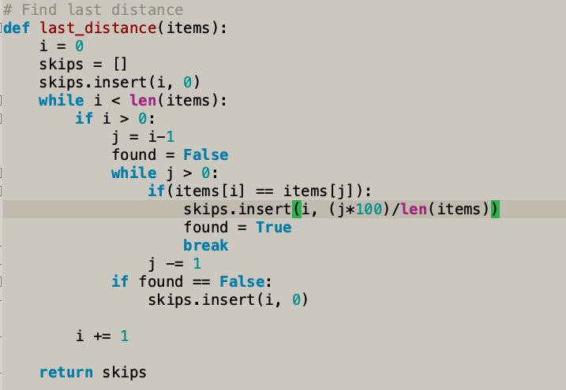

# Geany LightGray Theme

A light gray theme for Geany editor ported from Github theme.

## How to install

Download the `freedelta.conf` file to your `~/.config/geany/colorschemes` directory

Then pick up the color scheme named Freedelta

